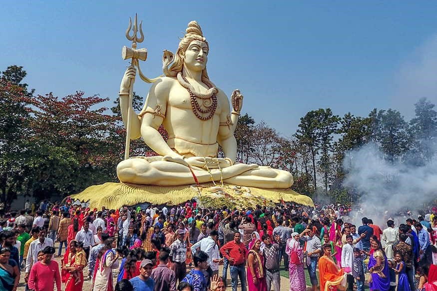

+++
author = "Prashaantkumar Raventeran"
title = "Maha Shivarathri"
date = "2021-03-31"
description = "How Mahashivarathiri is being celebrated around the world and its benefits to the devotees of Lord Shiva?"
slug = "maha-shivaratri"
image = "img_prashaanthkumar_1.jpg"
comments = false
# draft = true
tags = [
    "Group 4",
]
+++

---

Hindus celebrate many festivals around the world, such as Ganesha Chaturthi , Navarathiri, Durga Pooja and Maha Shivarathiri.

Maha Shivarathiri is an auspicious Hindu festival dedicated to Lord Shiva. This festival is celebrated annually by the Hindus around the world in countries like Nepal, West Indies, Punjab and Tamil Nadu. Not to forget in Singapore and Malaysia too.

Why is Mahashivathiri celebrated? While Shivarathri falls on the 14th day of each month of the lunar calendar, Mahashivathiri is celebrated only once a year before the arrival of summer. On this holy day, devotees worship Lord Shiva and seek his divine guidance. There are Puranic stories depicting that on this day, Lord Shiva saved the world from destruction.

The other reason for the celebration is because it has been said that this is the day Lord Shiva got married to Goddess Parvathi. We celebrate it by bathing in the holy water of Ganges, followed by bathing with milk and honey. Flowers are also placed around the statue. Offering beal leaves (vilvum), fruits and rice is considered auspicious during Mahashivaratri. The day is spent in meditation, fasting or singing bhajans of Lord Shiva. It is believed negative energies will be transformed into peaceful energies.  
Most importantly this festival is solemn and marks a remembrance of overcoming darkness and ignorance in life as well as in this world. Swami says that the lesson of Mahashivaratri is that devotees should foster good and scared thoughts (Mahashivarathri Divine Discourse Feb 25 1998).

---

## Gallery

---

#### References

1.	Wikipedia
2.	Google Images
3.	Newsroompost.com lifestyle
4.	www.Indiatoday.in information 

---

