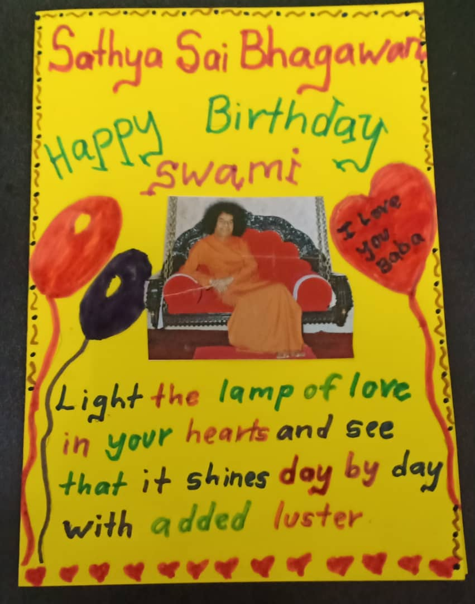
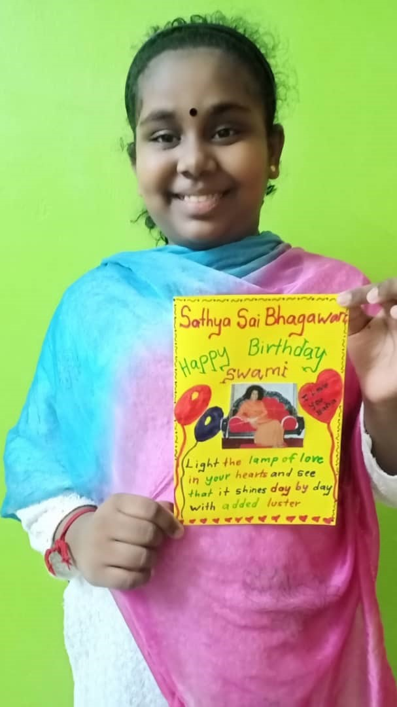

+++
author = "Sashviikaa Suresh"
title = "Greeting Card"
date = "2020-10-18"
description = "I show my love to swami by making Him a greeting card. Baba's Birthday is the date when divinity blossoms in my heart."
slug = "greeting-card"
image = "img_sashviikaa_suresh_1.jpeg"
comments = false
# draft = true
tags = [
    "Group 1",
]
+++

---

## Gallery

 

---
