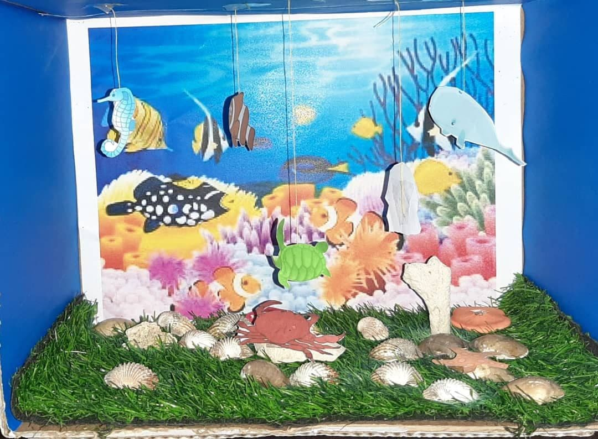
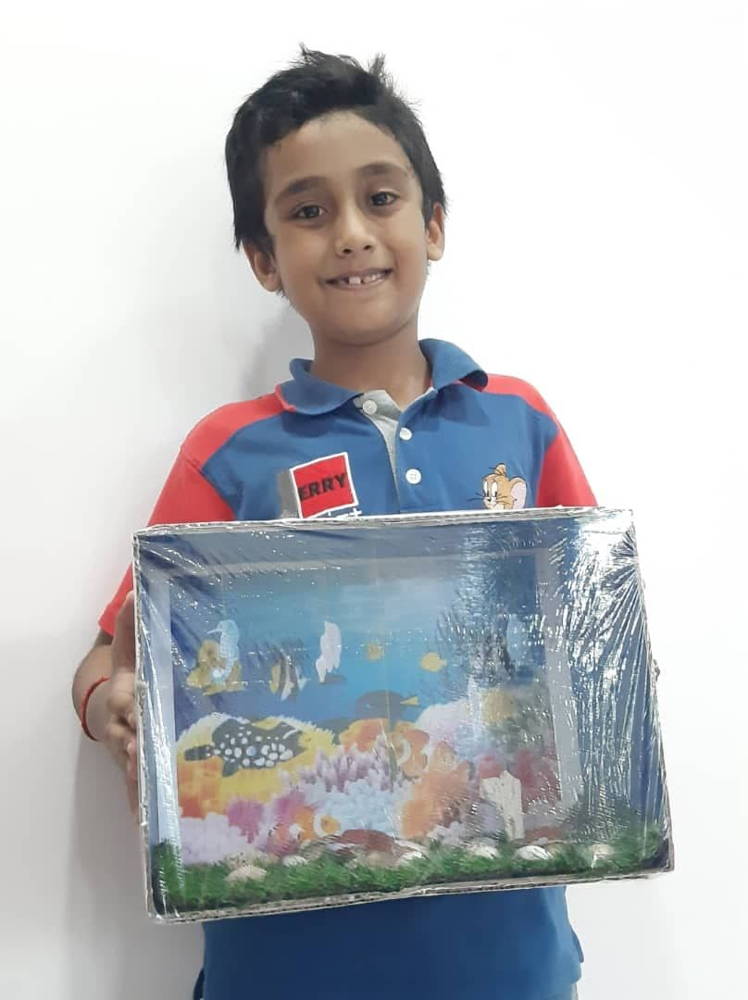
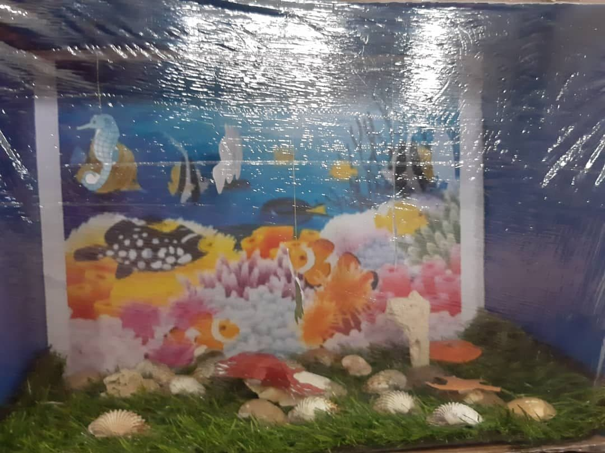
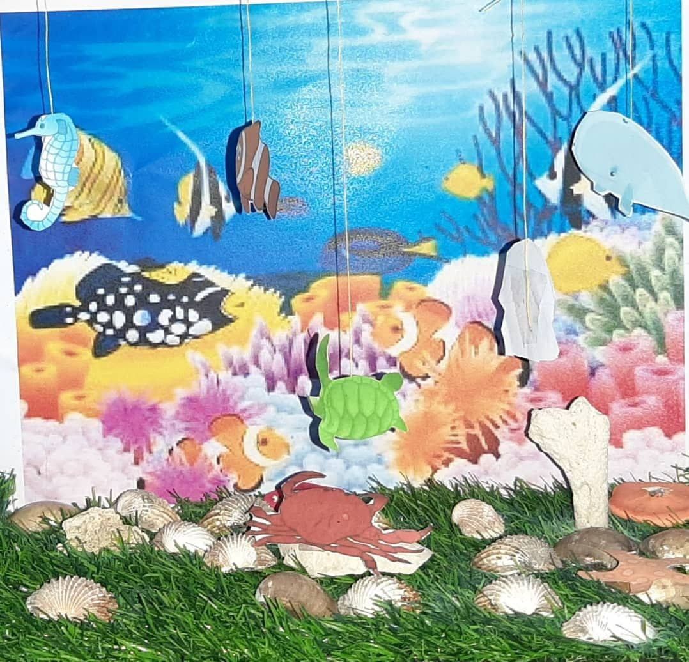
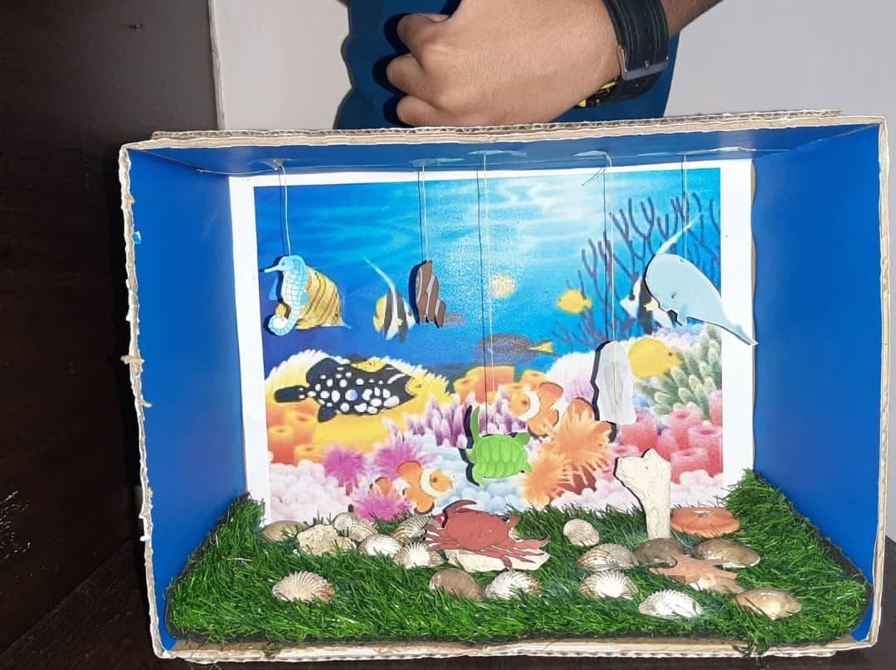

+++
author = "Sai Varshann Naidu Gunasegaran"
title = "Save The Ocean (Diorama)"
date = "2020-10-18"
description = "Fulfilling responsibility towards Mother Nature"
slug = "save-ocean"
image = "img_sai_varshann_1.jpg"
comments = false
draft = true
tags = [
    "Group 1",
]
+++

---

Oceans cover 71% of the planet and are home to important species and ecosystems that we rely on for food, livelihoods, climate regulation and more. But the oceans need our help. Saving the oceans can sometimes feel like an overwhelming task, but if we all pitch in, we can make a big difference.

We can save the ocean by practising the following habits:

1. Conserve Water. Use less water so excess runoff and wastewater will not flow into the ocean.
2. Reduce Pollutants. Choose nontoxic chemicals and dispose of herbicides, pesticides and cleaning products properly.
3. Reduce Waste
4. Shop Wisely
5. Reduce Vehicle Pollution
6. Use Less Energy
7. Fish Responsibly
8. Practice Safe Boating
 
We should save the ocean because the ocean produces over half of the world's oxygen and absorbs 50 times more carbon dioxide than our atmosphere. In terms of climate regulation, the oceans cover 70% of the Earth's surface and the ocean transports heat from the equator to the poles, hence regulating our climate and weather patterns.

---

## Gallery

    

---

#### References

1. https://oceana.org/living-blue/10-ways-you-can-help-save-oceans

---