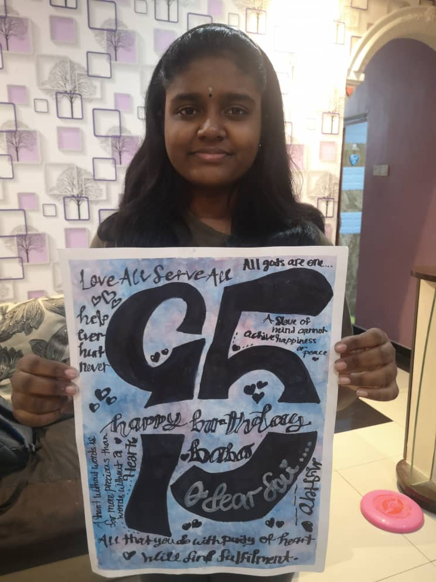
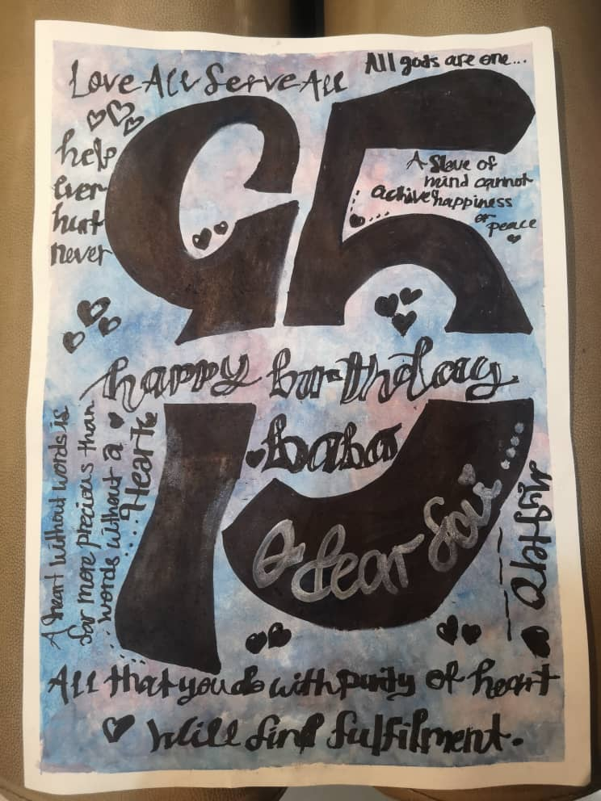

+++
author = "Darsina Nagarajah"
title = "Painting with Calligraphy Art"
date = "2020-10-18"
description = "The artwork which displays my love towards Bhagavan from the bottom of my heart with my own creativity and the mental help of Swami."
slug = "calligraphy-painting"
image = "img_darsina_nagarajah_1.jpg"
comments = false
draft = true
tags = [
    "Group 3",
]
+++

---

The background painting was inspired by pastel blue and pink aesthetics. A 95th birthday wish to Baba was lettered in calligraphic font. Some of Swami’s incredible quotes were written as well. Some details and decorations were added too.

---

## Gallery

 

---

#### References

https://youtu.be/9RwKGTMFhbo

---