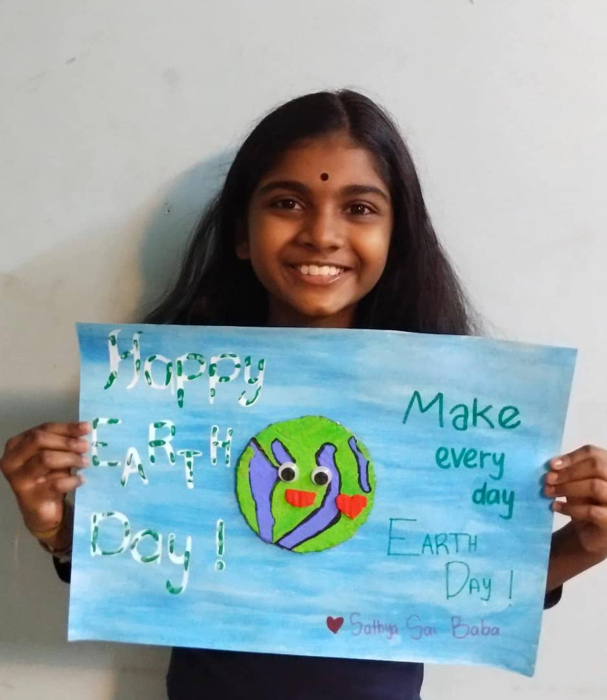
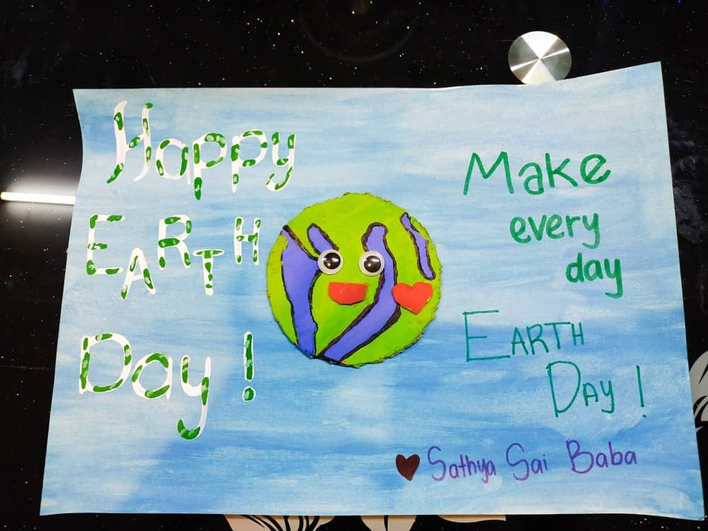

+++
author = "Veemeleswary"
title = " Earth Day Art"
date = "2021-04-30"
description = "Earth Day is observed to raise awareness related to environmental issues. Here's all you need to know about Earth Day 2021."
slug = "earth-day-art"
image = "img_veemeleswary_1.jpg"
comments = false
# draft = true
tags = [
    "Group 3",
]
+++

---

Earth Day is mostly celebrated by performing outdoor activities individually or in
groups. Activities such as planting trees, picking up roadside trash, conducting various programs for motivating sustainable living like making use of recycled materials, are performed. Some people also sign petitions to governments, calling for effective and immediate action to stop global warming and to reverse environmental damage.

Earth Day is not a public holiday. Programs at school, institutional levels are conducted to raise awareness among children. School kids make paintings, and fancy
dress competitions are also held to give out a message to the masses.

---

## Gallery

 

---

#### References

Pintrest: https://www.pinterest.com/