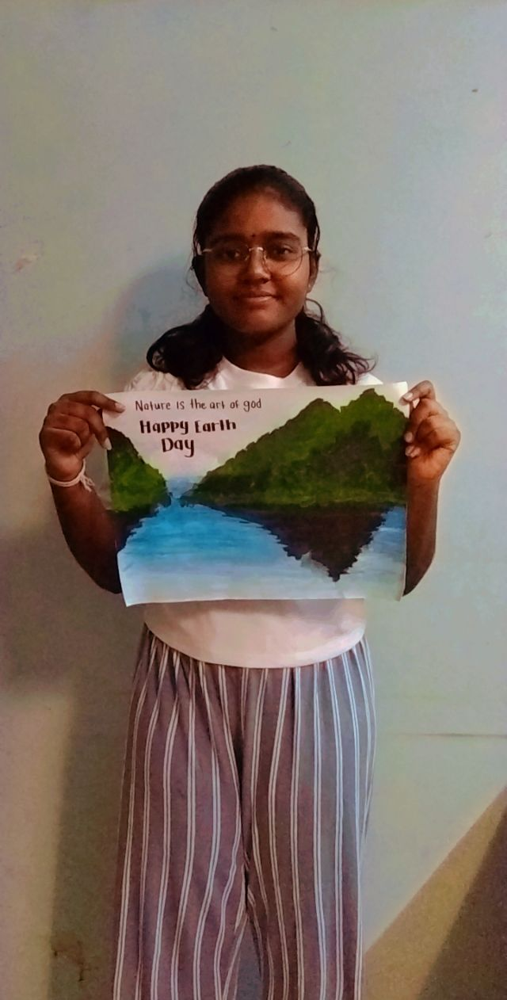
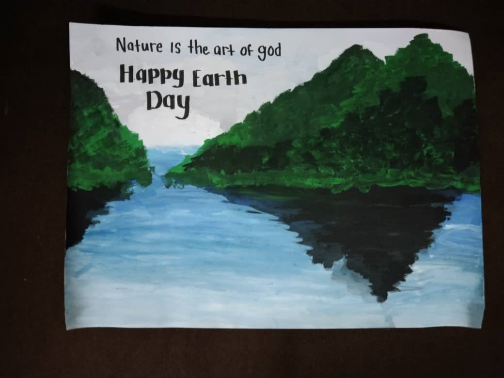

+++
author = "Darsina Nagarajah"
title = " Earth Day Painting"
date = "2021-04-30"
description = "The painting which potrays the beautiful nature that God gifted us."
slug = "earth-day-painting"
image = "img_darsina_1.jpg"
comments = false
# draft = true
tags = [
    "Group 3",
]
+++

---

A mountain landscape art work which was inspired by one of my idol’s painting from a reality show which I watched recently. The quote, “Nature is the art of God” was added to show that we should protect and love our nature wholeheartedly. Happy
Earth Day to everyone who lives in our beloved God’s green earth.

---

## Gallery

 

---

#### References

The K-pop band BTS’s member, Jeon Jungkook’s mountain side painting from their reality show “ BTS In The Soop”.