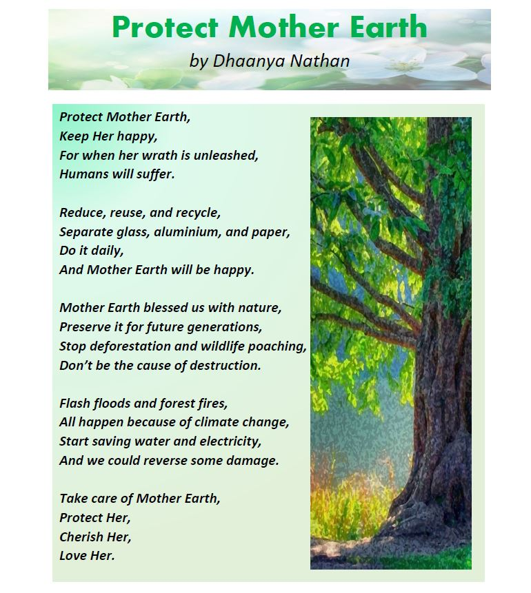

+++
author = "Dhaanya Nathan"
title = "Earth Day Poem"
date = "2021-04-30"
description = "A special poem inconjunction with Earth Day."
slug = "earth-day-poem"
image = "img_dhaanya_1.jpg"
comments = false
# draft = true
tags = [
    "Group 3",
]
+++

My mother, sister, and I brainstormed and wrote the poem. My mother then helped me with the layout. The layout was completed using the Microsoft Word program. The images are from Microsoft stock images.

---

## Gallery

---