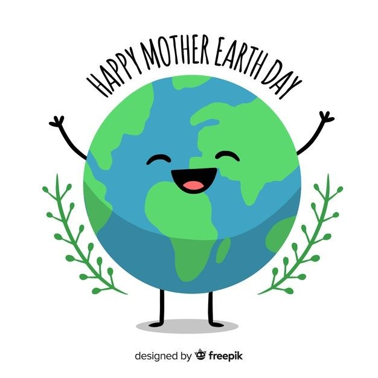
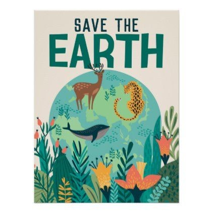
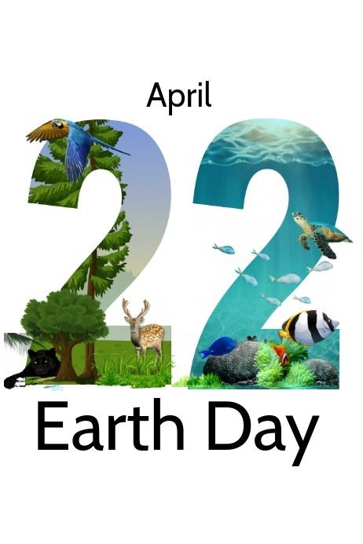

+++
author = "Venoshaa"
title = "Earth Day"
date = "2021-03-31"
description = "An article on Earth Day."
slug = "earth-day"
image = "img_venoshaa_1.jpg"
comments = false
# draft = true
tags = [
    "Group 3",
]
+++

---

### What is Earth Day?

Earth Day is a day we celebrate to show our love and appreciation to mother nature. This day is really important because we humans are starting to polluting the earth and making a mess in it. We also do some cleaning events all around the world so that we can live peacefully and happily again!

### Why do we celebrate Earth Day?

Aren’t we supposed to be thankful for living in this magnificent and beautiful earth? This is why we celebrate Earth Day, to be thankful and grateful to live in this amazing world. We have to clean this earth and make it into a better place so that we can survive here happily and calmly. Even the air will be fresher than it will ever be.

---

## Gallery

   

---