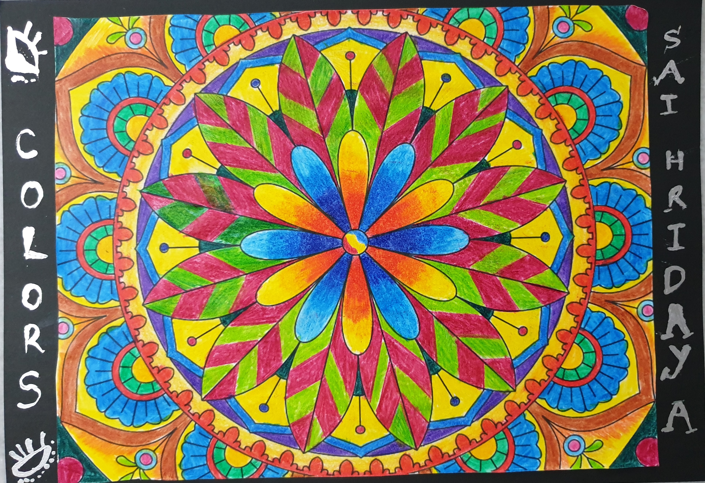

+++
author = "Sai Hridayaviharine Mohanram"
title = "C.O.L.O.U.R.S"
date = "2021-08-31"
description = ""
slug = "mandala-colours"
image = "img_SaiHridaya_Mandala_1.jpg"
comments = false
# draft = true
tags = [
    "Group 3",
]
+++

---

**What is a Mandala?**
The Mandala word comes from Sanskrit and means “What holds together “. It is a circle that symbolizes the cosmos and the circle of life. It is formed by a centre and drawings that flow into it. In the Orient, it is linked to the art of meditation, in fact, it is used to focus on the “centre of life”.

“Coloring mandalas allows the brain to enter a peaceful state and to be focused on filling in the geometrical shapes instead of thinking about their worries.” Did you know that the way that you colour your mandala can also change the meaning? Take a look at each colour and its meaning!

**Why colour the Mandala?**
The colouring is a beneficial activity for children and adults. Filling the white spaces, we detach from our problems. In fact, our breathing becomes deeper and our mind and body relax. The first to use colour as a form of therapy was Carl Jung, a 900’s Swiss psychoanalyst. He invited his patients to colour the mandala (figures that symbolize balance and perfection) because it calms people’s minds. For some years this practice has become commonplace thanks to mandala designs well-known benefits:

**How to colour the mandala?**
The mandala must be coloured without hesitation, with calm and precision. Use your imagination, fill the empty spaces with the colours you like, you can repeat the same colours in the same and symmetrical spaces. Children will learn to respect the spaces and the boundaries. The place where you paint must be silent, orderly and relaxing. You can put your favourite music to relax even more.

**What does the Mandala do?**
* Increases creativity and self-awareness
* Self-confidence: freedom to colour outside the lines if you want
* Refreshes the Brain
* Sparks Creativity
* Helps you achieve mindfulness

---

## Gallery

 

---
