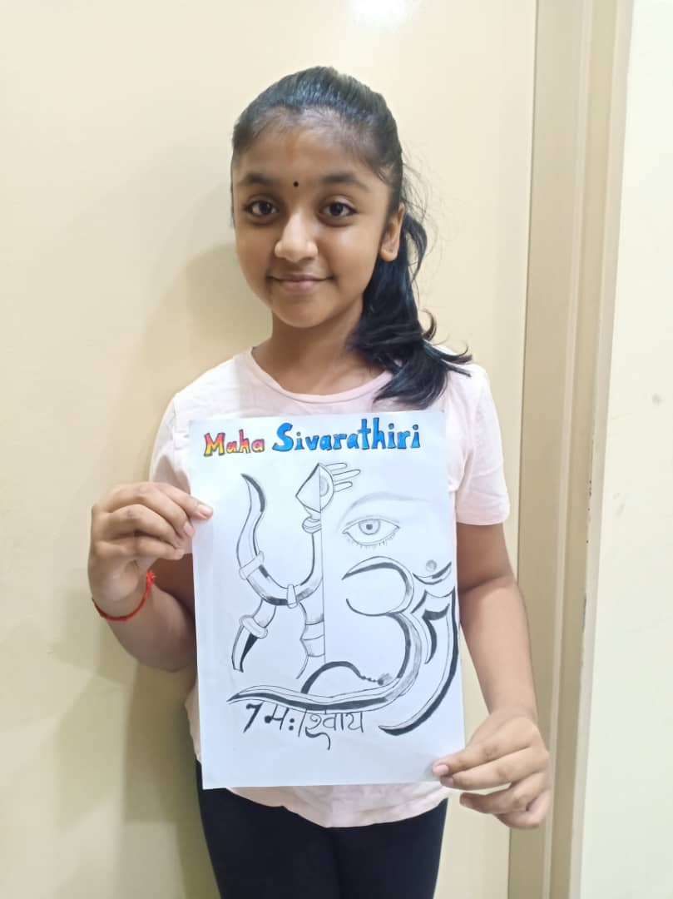
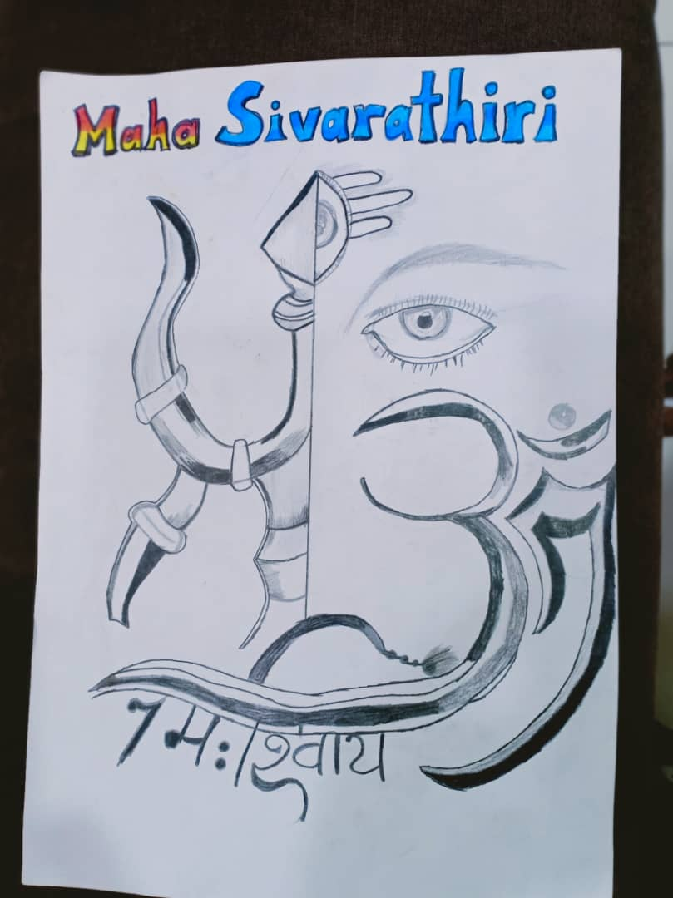

+++
author = "Mithirasnie"
title = "Mahashivarathri - Shiva & Shakti"
date = "2021-03-31"
description = "The meaning of Shiva and Shakti"
slug = "shiva-shakti-art"
image = "img_mithirasnie_1.jpeg"
comments = false
# draft = true
tags = [
    "Group 3",
]
+++

---

The Godhead, of which the masculine, passive, transcendent, eternal principle is Shiva, and the feminine, active, immanent, temporal principle is Shakti, the divine Mother.

---

## Gallery

 

---