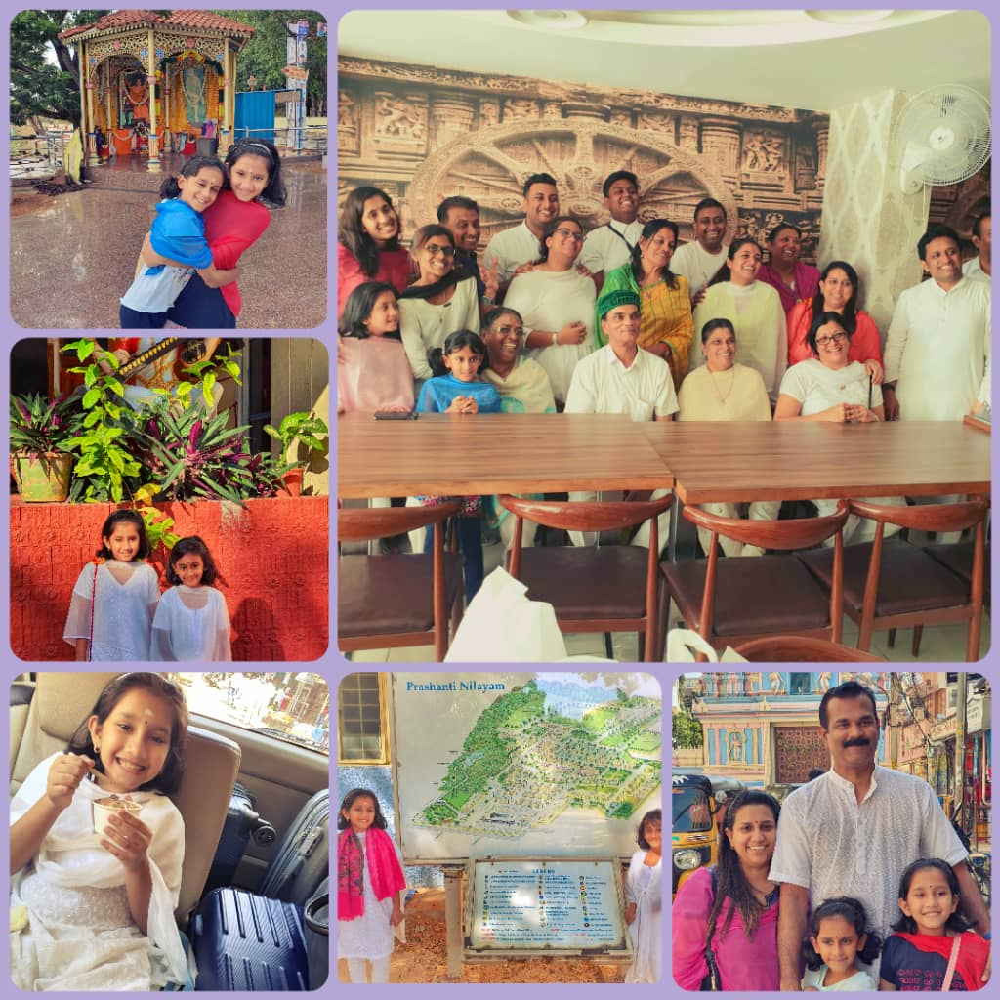

+++
author = "Shreya Eshani Suria Kumar"
title = "My Visit to the Abode of Supreme Peace"
date = "2020-10-23"
description = "My experience at Prashanti Nilayam in 2019."
slug = "abode-of-peace"
comments = false
image = "img_shreya_eshani_1.jpeg"
# draft = true
tags = [
    "Group 2",
]
+++

---

In December 2019, I had an amazing opportunity to visit Prashanti Nilayam, the Abode of Supreme Peace where many of us Sai followers would wish for to see with our very own eyes in this lifetime. I was fortunate that my parents made this trip happen and I eagerly waited for the day to come for many months since they started planning for it.

Our journey started at KLIA where we boarded the flight to Bangalore Airport, India. Puttaparthi is a town in Anantapur district of the Indian state of Andhra Pradesh. Prashanti Nilayam is the place where Baba resided. When we reached Bangalore, we were greeted by Uncle Kishore who then drove us to Puttarparthi. Uncle Kishore was a humble and kind man. We reached Puttaparthi very late at night so we could not enter the gates of Prashanti Nilayam, therefore we had to put up a night at a hotel nearby. We went to sleep but woke up very early the next morning as I was so excited to see the much talked about place by my Balvikas and parents.

Time had come, me and my sister got dressed in our white Punjabi suits and the loving Uncle Kishore fetched us from the hotel and drove us again to the Ashram. We reached the accommodation office and met some our friends Uncle Vimal and Aunty Ballet from Singapore who were eagerly waiting for us who greeted us with so much of love. We got our rooms and the experience from here was out of this world. We spent a lot of time in family satsangh and togetherness with our extended family from Singapore, Melbourne and Johor.

We got our map of the Ashram and started planning all that were going to do and places to visit and most importantly I wanted to have Western food! The things I enjoyed the most in Parthi was the food and bhajans. I had yummy ice cream, hot chocolate, toast and much more at the western canteen I frequented almost every day. Me and my sister spent most of our time at Bhajans, Vedic chanting, meals, visits to the mall and others with my mother, Aunty Ballet, Vidya and Vina Akka since they had strict rules of men and women being separated.

The bhajans were divine and I never missed a single bhajan. The atmosphere and surrounding was just so pleasant, calm and peaceful. Swami’s samadhi was divine and beautiful. We got to get his blessings everyday after bhajans.

My father made plans for us to visit Swami’s birth place, the Chitravathi river, Super Speciality Hospital, Kalpavriksha tree and few others. On the last day we visited the Chaitanya Jyothi Museum which was built 20 years ago to mark the 75th birthday of Baba. The museum spectacular and we also met Aunty Jaya who comes to Prashanti every year to serve at the Chaitanya Jyothi museum. It was nice to see her.

My experience in this whole adventure was wonderful and blissful. I would love to visit Prashanti again when the pandemic comes to an end.

---

## Gallery

---
