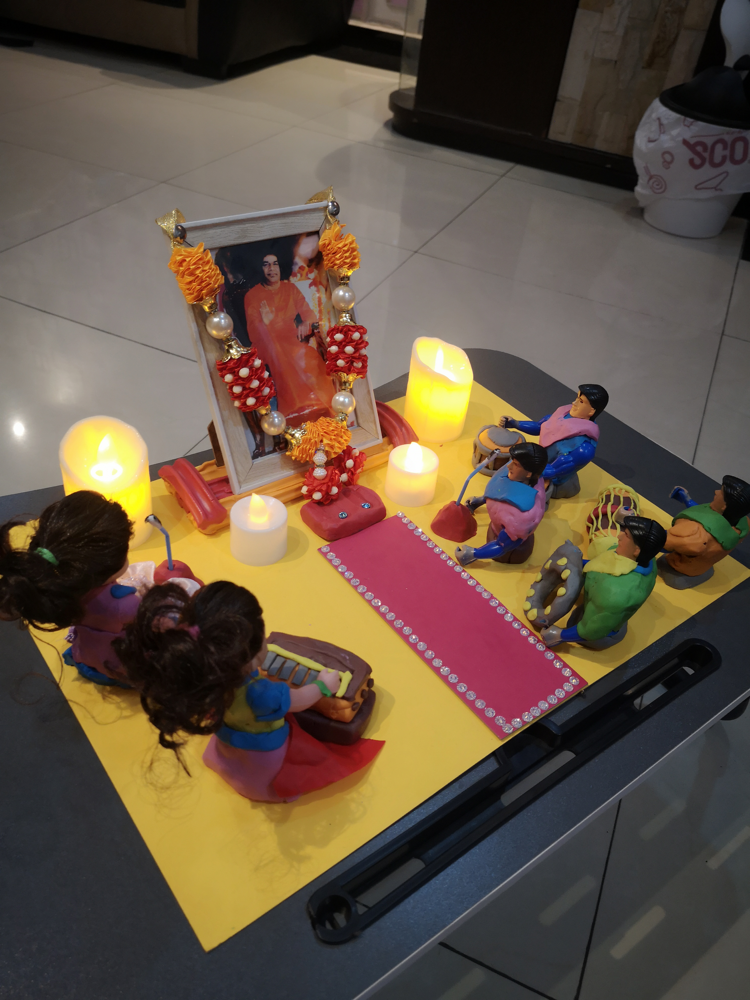
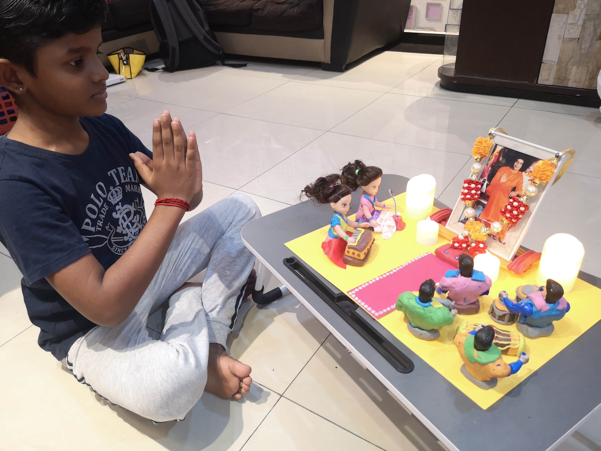
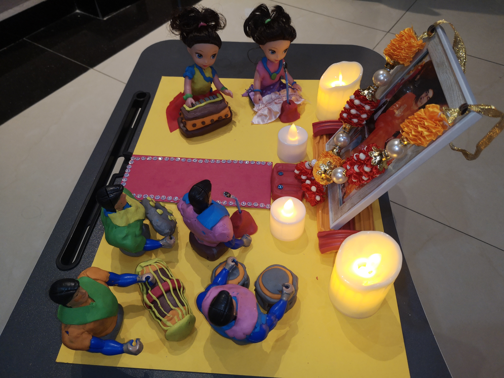
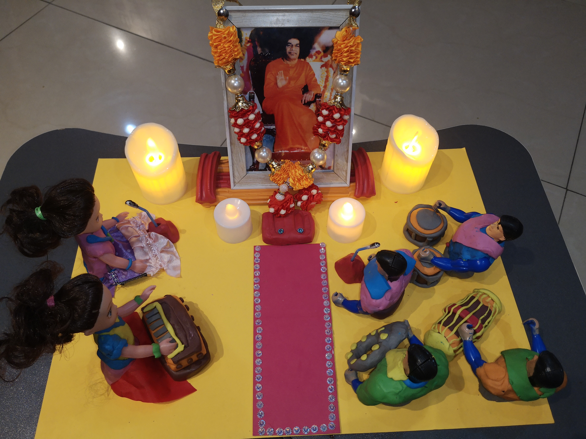
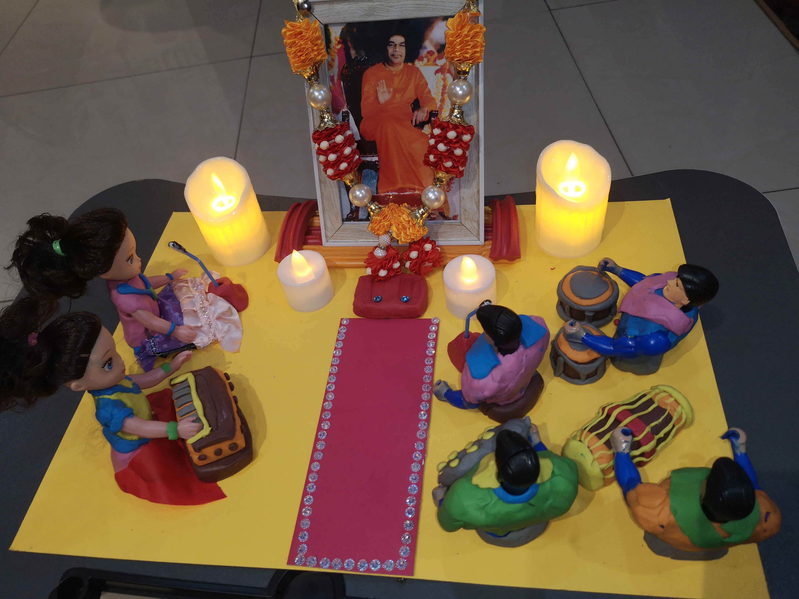

+++
author = "Santhossh Nagarajah"
title = "Bhajan Hall with Clay Art"
date = "2020-11-23"
description = "To describe my love towards Baba on His birthday and to expand my creativity through art and craft with the help of my family members."
slug = "clay-art"
image = "img_santhossh_nagarajah_2.jpg"
comments = false
# draft = true
tags = [
    "Group 2",
]
+++

---

This art was inspired by the weekly bhajans in our Sai centre. Small toy human sculptures were portrayed as devotees in a bhajan hall. Some traditional Indian musical instruments were sculptured as well. Small details were added as decorations. Swami’s portrait was placed in the  middle.

---

## Gallery

    

 

---