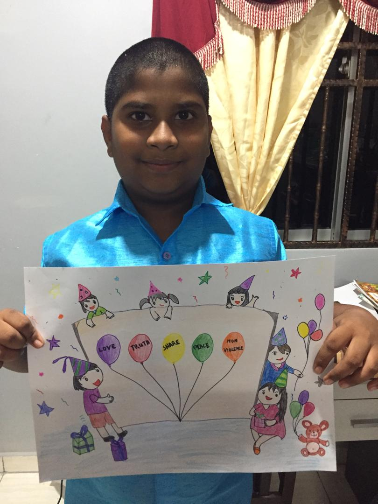
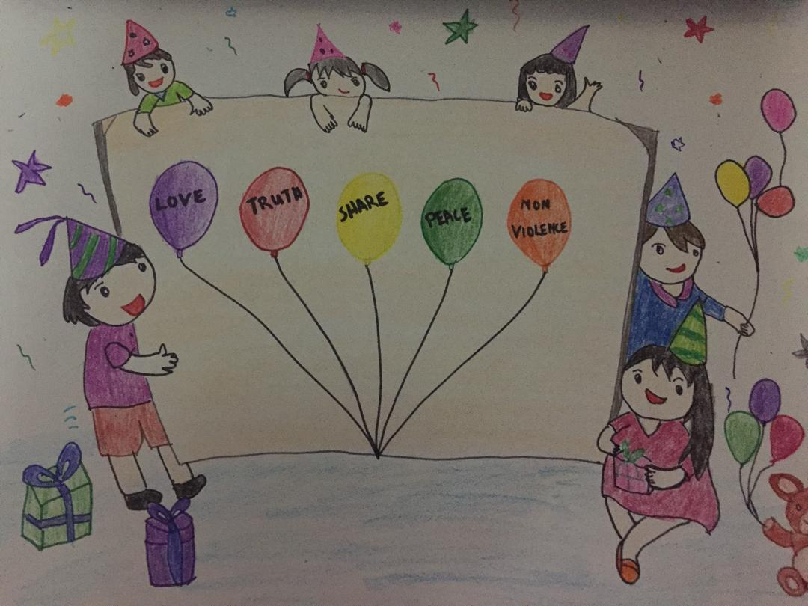

+++
author = "Hemmaraj Hiran"
title = "Human Values Drawing"
date = "2020-10-24"
description = "My describe on Baba's love on his birthday and to expand my creativity drawing with help by my family members."
slug = "hv-drawing"
image = "img_hemmaraj_hiran_1.JPG"
comments = false
tags = [
    "Group 2",
]
+++

---

This artwork reflects the Human Values that I have learnt from my weekly Balvikas and bhajan class in centre / online classes. It makes me to be self-disciplined. I also remember that Swami said to practice "Truth, Honesty and Fairness". I also learned meditation so that I can keep myself happy. I am always reminded of Swami's saying - "I am always with you, in you, above you and around you".

---

## Gallery

 

 

---