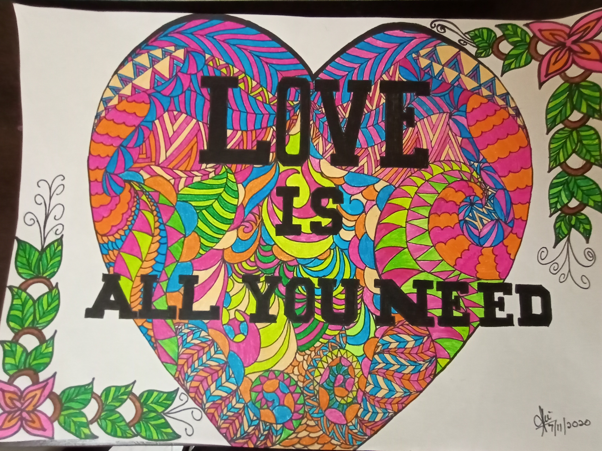

+++
author = "Shamani Nadaraja"
title = "Love Is All You Need"
date = "2020-10-24"
description = "Mandala Art with a concept of love."
slug = "mandala-art"
image = "img_shamani_nadaraja_1.jpg"
comments = false
# draft = true
tags = [
    "SSE / SSEHV Gurus",
]
+++

---

Mandala Art with a concept of love. Swami was my inspiration and the
colours were from the idea of colourful life. Colours describe joyfulness and happiness in one’s life. Mandala Art is something I’ve learn to be patience and manage my emotions.

Thank you

---

## Gallery

---