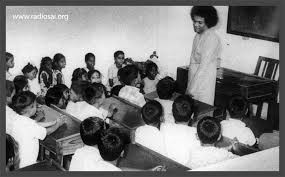
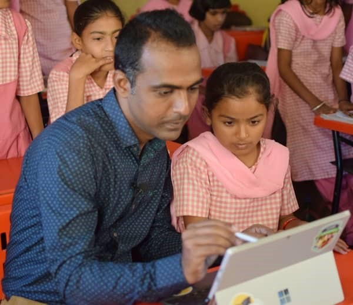
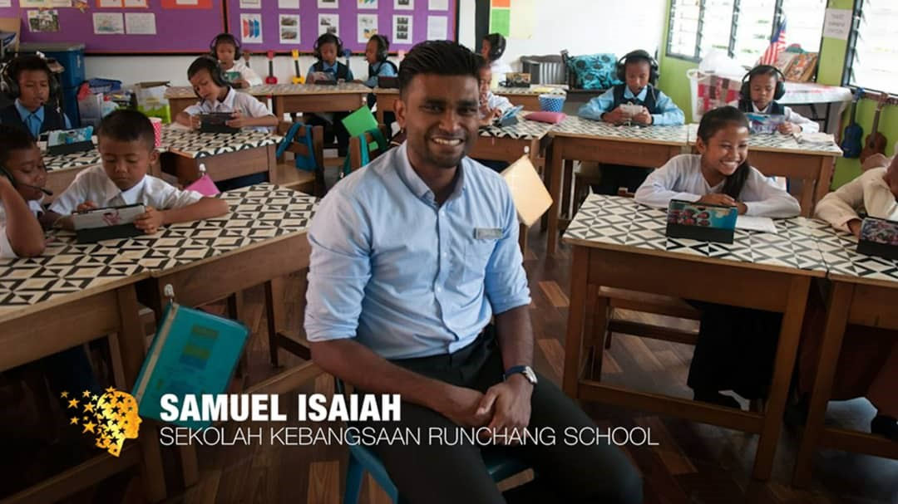

+++
author = "Kamala Perumal"
title = "The Inspiring Teachers"
date = "2021-03-31"
description = "An article on 3 inspiring teachers."
slug = "inspiring-teachers"
comments = false
# draft = true
tags = [
    "SSE / SSEHV Gurus",
]
+++

---

### Building a better world through education starts with bold ideas.

It’s my pleasure to introduce 3 teachers who started educating nations with bold ideas. The first teacher is our first Guru- Sathya Sai Baba.  

Baba often says that teachers are the pathfinders of the nation. Baba being the all-pervading realised that there is an urgent need to reform children and turn them in the right direction because children's minds are innocent and pure. Baba founded Balavihars which is now known as Balvikas as early as 1968. The aim of the education is that it should bring about an all-round development of the personalities of the students.   The main objectives of this Balvikas programme are to instill self-confidence, respect for the elders, instill good moral characters and always be in the spirit of service, love, kind, and be helpful to others.  In other words from Sai Baba, “broaden the heart and expand one’s love”. Baba being the childbrain had crafted this wholesome programme which is now being adopted and adapted by many countries.  

### Teachers are the nation-builders.

Now let me introduce the second builder- Teacher  Ranjithsinh Disale. He is an Indian teacher from Maharashtra India. Winner of 1 million Annual Global Teacher prize 2020. Teacher Ranjithsinh’s work is to help the girls, most of them from poor tribal communities at a village school in Western India. He campaigned to eliminate adolescent marriages and encouraged to educate girls. He inspired his students by reading and translating textbooks into their mother tongue language using QR codes to primary category books so that his students can get links to audio, poems, stories, assignments, and he also plays Bollywood movies to attract the children to attend school. He had transformed the life chances of young girls at the Zilla Parishad Primary School Solapur Maharashtra. When asked what motivated him to go this far? He said,” Only, teachers have the power to change the world for a better tomorrow. I teach with love, care, and passion."

In his winning speech, Disale said that he would share with his nine finalists, the winning prize monetary value to educate the underprivileged children around the globe. ‘Sharing is growing, God gives us and we have to share it, we don't have to keep it for ourselves.

 

The third builder -Teacher Samuel Isaiah. He is a Malaysian. He was nominated as the top 10 finalists for the prestigious Global Teacher Prize 2020. His work was recognised globally for the hard work he put forward to uplift the education of the Orang Asli children in Runchang Orang Asli settlement. Samuel saw that the main obstacle in teaching these children was the perception on the part of many teachers that the indigenous were not worthy of their efforts. He took the situation as a challenge and improved it by using technology.  Eventually, his students' pass rate in English improved. Samuel not only  incorporated technology in his teachings but also blended it with love and care. He travelled about 200km daily to school- Sekolah Kebangsaan Ranchang Orang Asli without giving excuses or hesitations because of his passion and dedication in educating the orang Asli kids.

Sir Samuel proudly said; ‘I do not feel defeated”.The winner Sir Ranjith Sinh from India is a victory for children education and all teachers out there who have been going the extra mile to teach.

 

 

## Gallery

  

---
