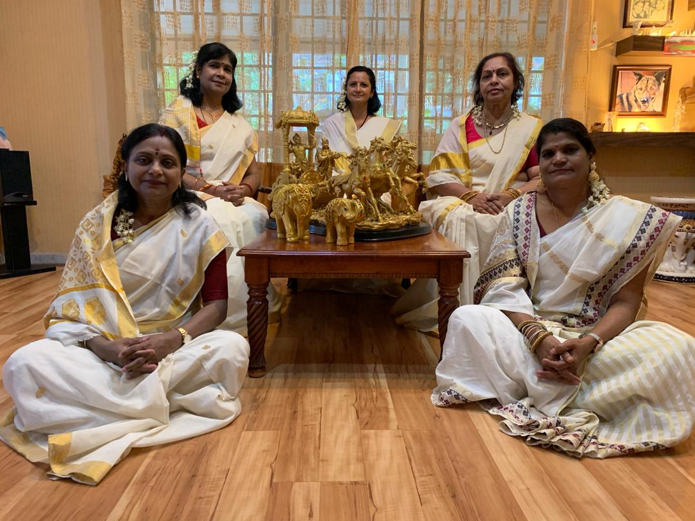

+++
author = "Chitra Menon"
title = "Divine Grace"
date = "2020-11-23"
description = "Gita Samarpanam is a group born out of the vision and initiation of Aunty Jegadeva to recite the verses of Chapter 12 on Bhakti Yoga or Path of Devotion from the most revered holy book - the Bhagavad Gita"
slug = "divine-grace"
image = "divine_grace.jpg"
comments = false
# draft = true
tags = [
    "Ladies",
]
+++

---

The Gita Samarpanam is to be an offering to Bhagawan on Ladies Day for the year 2020.

I grabbed this opportunity to be a part of the sadhana not only as an offering but more importantly to learn to chant the verses. Having tried unsuccessfully and intimidated by the Sanskrit verses, I had given up learning the Bhagavad Gita altogether. Now, with this opportunity, I had it all beautifully planned and laid out smoothly for me, right in the comfort of my home. Classes were to be conducted through Zoom conferencing, in light of the coronavirus pandemic. What a blessing!!!
Classes commenced on the 22nd of June 2020 and it was conducted by Sister Girija, who was well versed in the subject as she was exposed to spirituality at a tender age. She had grown up on the lap of her uncle, the spiritual leader, Swami Chinmayananda. We were blessed to have her teaching us. Sister Girija began her sadhana with an introduction into the scene of the Kurukshetra war and a glimpse into Chapter 12. I was completely blown away and thought to myself “what had I missed all my life”. It has taken me six decades to get a peek into this treasure trove of wisdom. “Well, better late than never”, I consoled myself. By the end of the first class I was in bliss and I was beaming with happiness. From then on, I began to yearn to know more and experienced an indescribable feeling of pure joy after each session.

Sister Girija began to unravel the meaning of each verse on Arjuna’s enquiry to Lord Krishna. Her explanations were soul stirring and she narrated stories and shared life experiences of great saints thereby demonstrating her vast knowledge on the Bhagavad Gita. It was a real treat to all who were blessed to attend and gain her insights. Her constant encouragement to keep our enthusiasm and earnest longing to learn gave us the inspiration to do our best in the chanting of the verses. A mammoth task lay in front of me that needed a lot of effort. I realised that in order to transform this knowledge into bhakti, I would need to integrate it with my life or “it will be a useless tinsel”, as said by Adi Shankara. Practice, practice and practice is now my constant reminder. Doable by making small steps echoes my inner voice.
It took Sister Girija 10 days to complete the 20 verses and then she taught us the Bhagavad Gita Dhyanam or Meditation on the Gita. 

These verses are sung before the recitation or as an invocation to the Gita. All the verses learnt have such a profound meaning in my life now.

All of a sudden, the Covid-19 cases began to rise again and we faced another movement control order. The pandemic now challenged us to complete our offering together in conjunction with Ladies Day 2020. All of us (SSBC Bandar Klang was represented by Sis Jenobai, Sis Nirmala, Sis Sudha and myself with Sis Nageswary from Sri Muda Centre joining us) held on strongly to shraddha or faith in the Lord with no doubt. We were then advised that each centre would need to record their recital (we were given 4 verses to recite) and these recordings would then be compiled to be presented to our Bhagavan on the 19th of November. With divine grace, we gathered in Sister Nirmala’s house on the 18th of October for the video recording. With the kind effort of Bro Naveen, Sis Chandini, Bro Lekshman and all the sisters, we completed our task.  

Currently, we are continuing our revision on all the 20 verses from Chapter 12 and will humbly present it to our Swami with all our love and gratitude on the 19th of November 2020.

I am ever so grateful to Aunty Jegadeva and Sis Girija for making it possible to be a part of this sadhana. Most of all, my humble salutations to Bhagavan for without His Divine Grace, this would never have been possible as “Not a Blade of Grass Moves Without His Will”.

 

---



Mookam Karoti Vachalam 
Pangum Lankayathe Girim 
Yath Krupa Thamaham Vandhe 
Paramananda Madhavam 
 
I remember with Devotion the Divine Grace of Krishna Who can make the Dumb speak with eloquence and the Lame cross high Mountains. I remember and extol that grace which flows from supreme bliss manifestation of Madhava.



 

---

## Gallery

 

---