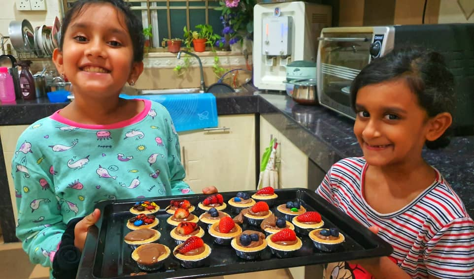
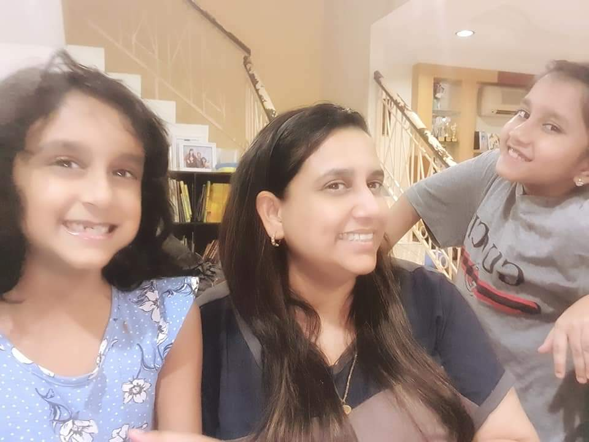
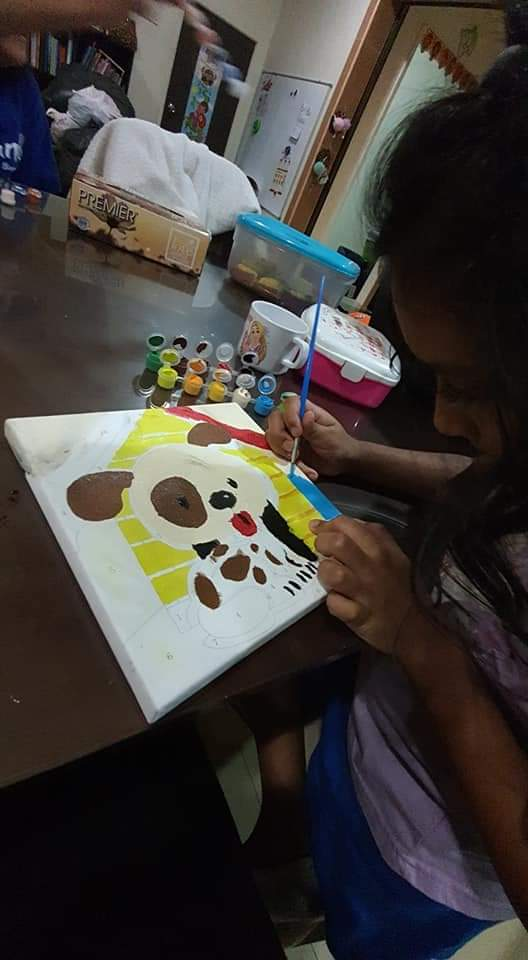
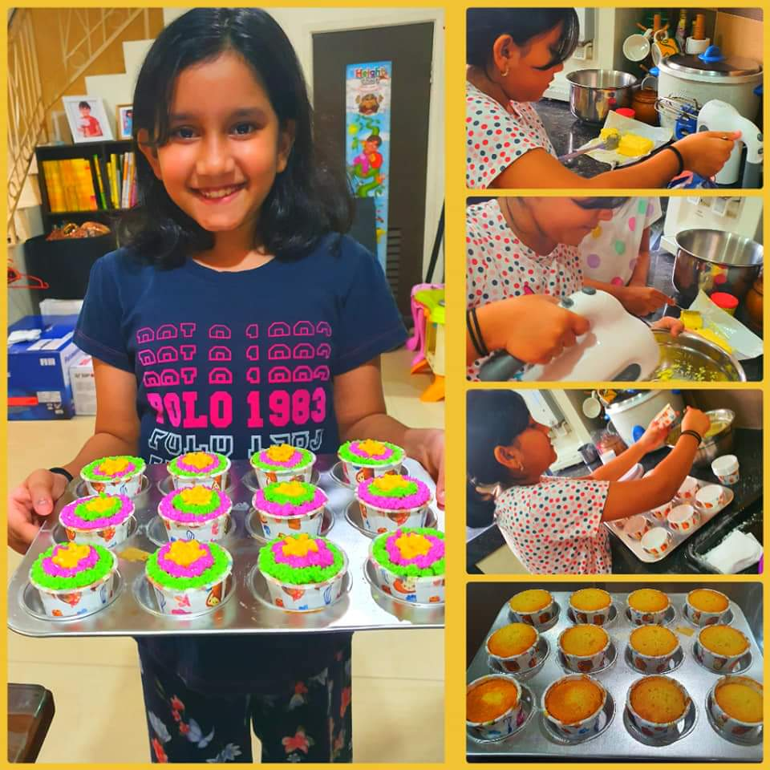
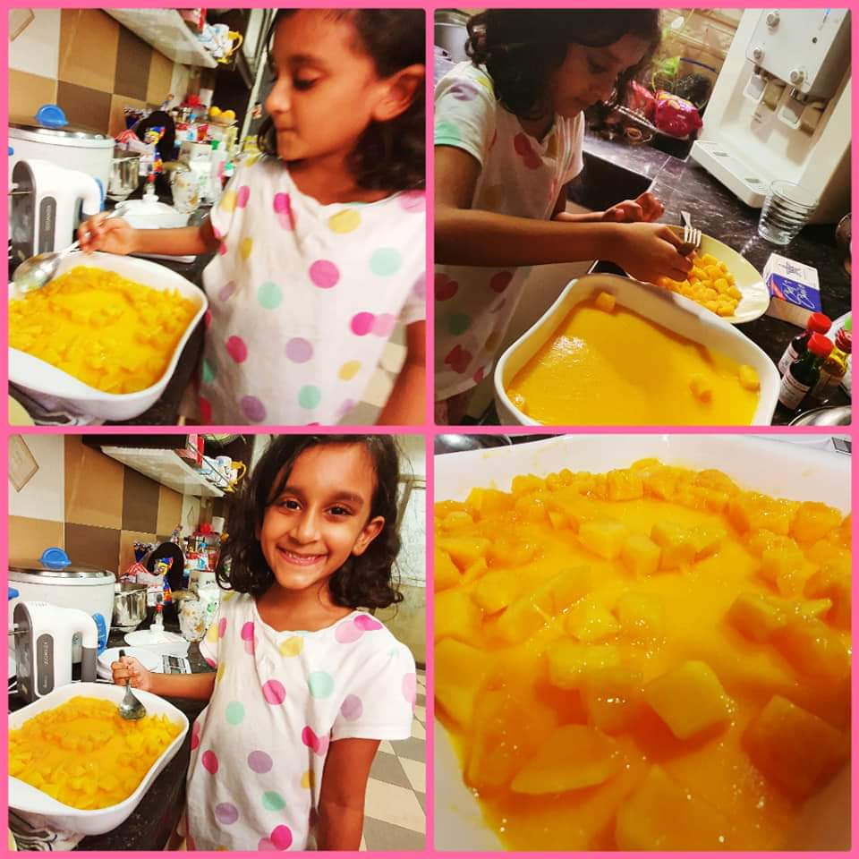

+++
author = "Sajeeta Suppiah"
title = "Family is EVERYTHING"
date = "2020-11-23"
description = "An article pertaining to my experiences during Covid - how I used this opportunity towards keeping my family together through life skills learnt and spiritual advancements together."
slug = "family-is-everything"
image = "img2.jpeg"
comments = false
# draft = true
tags = [
    "Ladies",
]
+++

---

Amidst the widespread of Covid-19 we have all been lifted into another way of living. Our lives have been slowed down by an amazingly small organism with a huge amount of power. In March 2020, when the Movement Control Order was announced, there was sudden fear and panic everywhere.

Each day presented us with a new set of rules and changes that gave us a reason to pause. Schools closing, kids zoning out during endless Zoom classes, holiday plans cancelled. There was so much uncertainty and a feeling of being out of control. My world somewhat came to a pause. I had so many questions on my mind, how do I put this together? I need to continue working, my kids needed to keep the momentum going with lessons, my staff needed direction, I wouldn’t be seeing my mother whom I met every day and many more. It was a choice we needed to make on being careful and social distancing to keep the young ones and elderly safe even though we stayed so close to each other. Of course, there was my husband holding the fort together, and I too felt that we must deal with this together as we had little lives dependent on us. 

It is then I sat and calmed myself and told myself - you’ve got this! Instead of asking, “When will this all end?” I asked, “How can I grow from this?” Swami once said,

> "Why get agitated? Let Me take care of all your business. I shall be the one who will think about them. I am waiting for nothing else than your surrender to Me, and then you do not have to worry anymore about anything. Say farewell to all fears and discouragement."

I began positive self-talk. It’s amazing how positive self-talk influences your subconscious mind and reveals thoughts, beliefs and ideas. As I began doing this daily, I had a sense of calmness and peace. My husband too was of great support to my emotional well-being and kept reassuring me that even this shall pass. I was able to think more clearly, my mind was just on prayer! That is the one thing that was within my control that I could do. I set aside all the unanswered questions and began putting things in action. My girls and I would recite the Gayathri Mantra 108 times every morning, afternoon and evening. Followed by collated prayers with members of the Organisation. The daily prayers then led to self-reflection and gratitude.

I realised even during the hardest of times there was still so much that I could authentically be grateful for. I woke up and thanked GOD for the air and light. For the ability to see and smell. For this very gift of life and giving me the chance to begin each day. And even if it was for just a few moments a day, I felt so grateful for the tiniest details I noticed around me; for shelter, sunrise, food and the greatest of all was having my family safe and sound.

We started to plan our meals together as a family. I always loved cooking and baking and this was the best time to experiment more, yet being moderate. My girls were taught to prepare very simple meals, we baked together, we sat down and did activities together, we played board games, we designed clothes for their collection of Barbie dolls, we painted together, there were endless movie nights and gardening on top of my daily routine of Working from Home. As days went by, I began to feel more at peace, more joy and surely a deeper sense of gratitude. I looked around me and realised I had my girls and husband, right here beside me. Something I have been longing for for a long time. There were moments in my life as a working mother when I would have the working-mom-guilt. I felt time running so fast to achieve my career aspirations, while my kids were growing up so quickly. But in a blink of an eye even this changed. That’s when I recalled Swami saying

> "Love My Uncertainty"

I don’t know how or when the pandemic will end, but I know that the miracle of life is now. I thank Swami for this beautiful gift of life and for my loving family. To me, family is not just an important thing but it is EVERYTHING. 

 

---

## Gallery

    

 

---