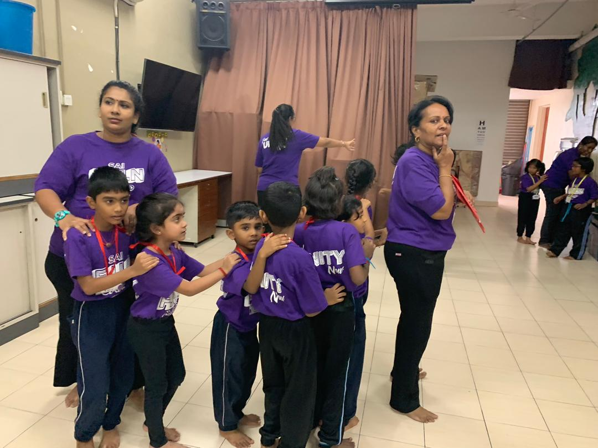
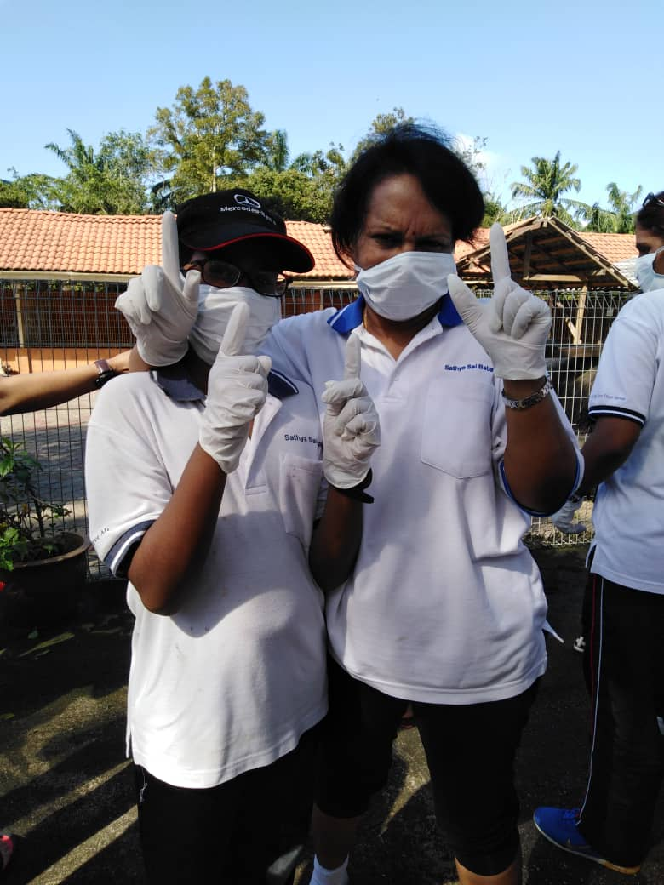
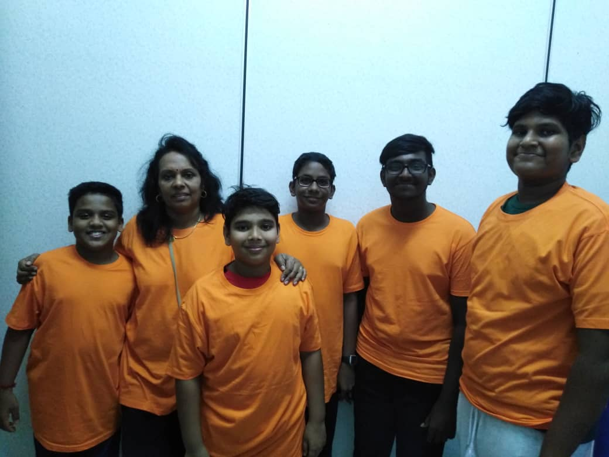
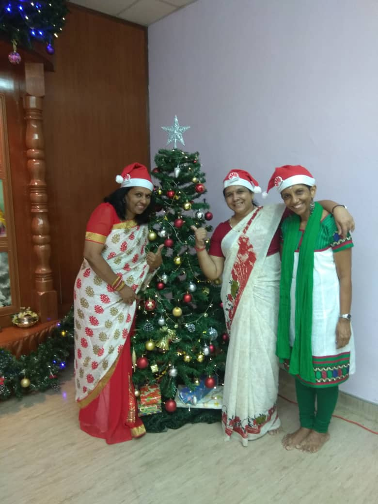

+++
author = "Kamala Perumal"
title = "Service of Love"
date = "2020-10-24"
description = "Why doing service is important to you? How does the seva improve you as a person as a spiritual aspirant as a guru?"
slug = "service-of-love"
image = "service_of_love_4.jpg"
comments = false
draft = true
tags = [
    "Ladies",
]
+++

## Why doing service is important to you? How does the seva improve you as a person as a spiritual aspirant as a guru?

Well, I don’t know that seva means performing without expecting a reward, or a result of an outcome. Little I know that Seva is a powerful tool to learn about myself, be it inner or outer. I was doing it for my grandmother, father, mom, siblings, and my school teachers continuously since I was a little girl. Then Swami emerged into my life from a partially closed door to an opened door. He further enhanced me that there’s no greater service than service to mankind. Hence performing service. Nar Seva, Narayan Seva has become part and parcel of my life and I’ve totally lost in it.  I’m here for a reason and the reason is to render my service to mankind which is my utmost priority.

### Quote by Mahatma Ghandhi

> 'The best way to find yourself is to lose yourself in the service of others.' 

Service is meant to pursuit one's own interests for the betterment of oneself and as a collective gain. And it is considered the most important part of any spiritual practice. I remind myself, If I love my guru then I must show it by doing seva with love and compassion. There are many types of services one can perform either as a volunteer to feed the poor and the needy, being a counselor, a doctor, a nurse, or a teacher. 

I choose to be a Balvikas Guru simply because teaching is my passion. Baba said, being a Guru is a noble profession. Filling a child's mind at a tender age with holy and sacred thoughts guarantees a better person in the future. I believe Swami has given me this beautiful opportunity of nurturing and shaping of the younger generation. I enjoy teaching kids tremendously because they bring a lot of joy to me and I make sure I give and prepare all the opportunities for them to enjoy their childhood wholesomely and make a difference in a child's life. 

The most important part is doing seva as a Balvikas guru certainly without any doubts transformed me to be a better person. By drawing a lesson based on values allows me to learn more of myself and what I need to do for my transformation and how I can set a good example for others. Conducting and running the class gives me the chance to be associated with Swami. The time spent during the class opens me up to God, reminds me of His existence and His Wonders in this world. Hence, I never forget to thank and appreciate Him for this birth. 

Furthermore, as a Balvikas Guru, I feel I'm staying connected with His presence because the children in the class indirectly teach and infect me with their pure love. Their singing of Bhajans and Sketches gives me a sense of pleasure and not forgetting the moral values that I too learn along with them.

Last but not the end, I thank Swami for I'm the chosen one in his Vision and Mission. Thanking him again for the opportunity to be his instrument to transform the society but also for me.   

---

## Gallery

     

 

---