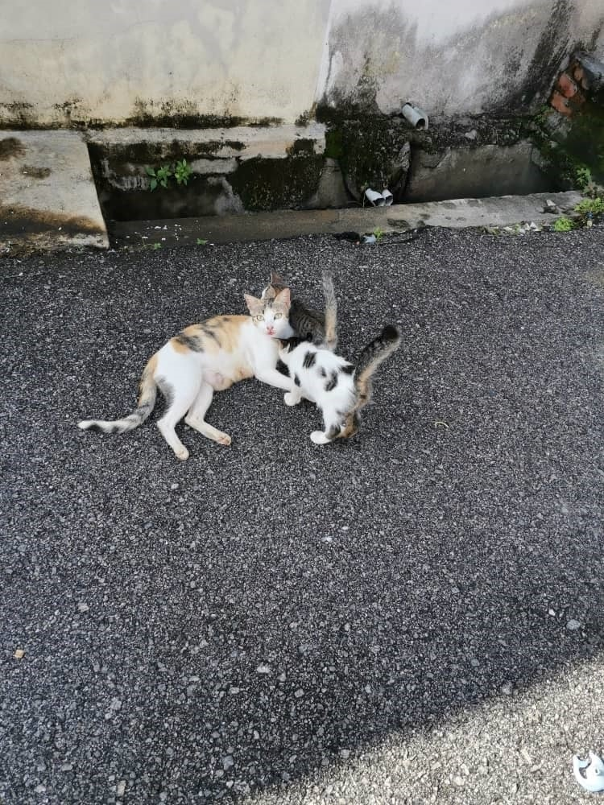
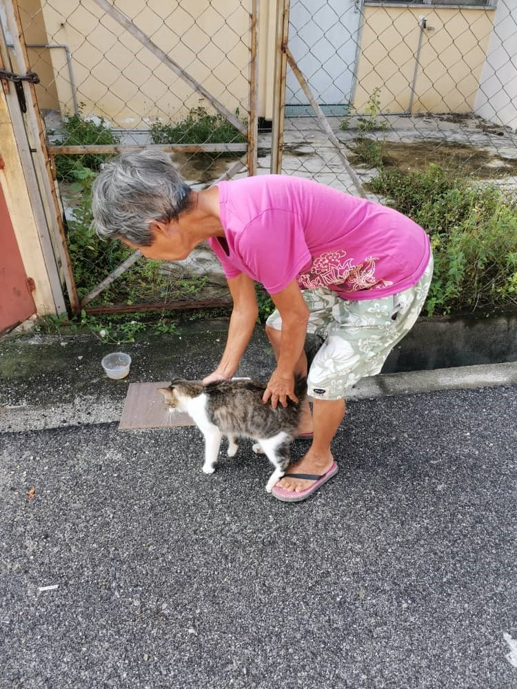

+++
author = "Kamala Perumal"
title = "Aunty Molly Long"
date = "2021-01-01"
description = "An article on animal care service done by Aunty Molly Long."
slug = "aunty-molly"
image = "img_kamala_2.jpg"
comments = false
tags = [
    "Service",
]
+++

---

To be loving, caring and heartful to animals is no question about religion or nationality but that of humanity.

Aunty Molly Long, a 70 year old lady who resides in Taman Sri Andalas Klang has been a mother to about 20 stray cats and 5 stray dogs. She has been taking care of them for the past 12 years. Aunt Long is married with 2 children who understand their mother’s love for animals. Her day would not start without feeding the strays at the back alley. At 8.00 am she would walk with a stainless-steel bowl of rice and “pedigree” pet food. She would then place the food at a few specific spots. The cats and dogs would finish their first meal of the day. Then at 5.00 pm, Aunt Molly would again to serve their second meal. She often calls them by special names, to which they would respond quickly. Her impulsive care for them is so natural, like a mother who naturally takes care of her children. Hence this routine has been part and parcel of her life. 

When asked why she has a special attachment towards the animals, her answer was very simple - She grew up with them when she was a kid and always felt that the animals were part of her family. She also believes that every animal needs to be taken care of, given shelter and veterinary care because they have a purpose in this world. They are part of God's creation. She further added that it is her commitment to look after them as a human being. 

Some words of wisdom from Aunt Molly; Please do not see their color or breed but please do adopt them. If we treat them with love and compassion, they will also do the same towards us. It is our responsibility to ensure that all animals are under good care.   



Animals are such pleasant friends - they are better than humans because they don't ask questions, they don’t discriminate nor criticise.  

Aunty Molly Long



---

## Gallery

 

---
