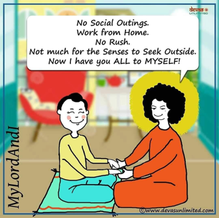

+++
author = "Anjulah Mohanram"
title = "I Have You All to Myself"
date = "2020-11-23"
description = "Collection of testimonials from devotees."
slug = "i-have-you-all-to-myself"
image = "img_i_have_you_all_to_myself.png"
comments = false
tags = [
    "Spiritual",
]
+++

---

> Sis Jothi Bhai, New Zealand

True. Only yesterday I was sharing that the 'intensity of closeness' to Swami is felt now more during this Pandemic.  More opportunities to go within.

> Sis Veni, Malaysia (Klang)

Yeah, this pandemic gives us more time to approach Swami and bonding with family, nature and friends.

> Sis Shamani Nadaraja, Malaysia (Klang)

I have learnt to spend quality time with family doing great things for myself and not forgetting the new friends from the nature. I love this change. All this makes me feel swami and his love.

> Sis Nirmala Devi, , Malaysia (Klang)

"I have you all to myself", so, what's next?

This pandemic is a natural occurrence for all the negative thoughts, words and deeds of humans. We are shut down so that we can go deep within and find out the reasons for this spread of viruses. It's a special time given by almighty to reflect our wrong actions to nature and rectify them. Until then, there's going to be no cure. Hopefully good transformation emerges from humans. Whatever is happening has to take place for the good of this world and mankind. If not now, then it will be too late. So, our prayers should be for transformation to take place and not to end the pandemic, because God knows the best time to end it. Jai Sai Ram.

---

## Gallery

 

---