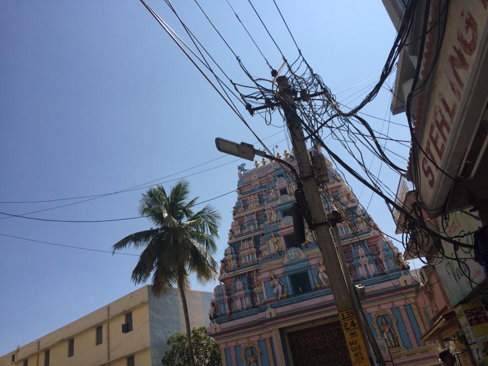
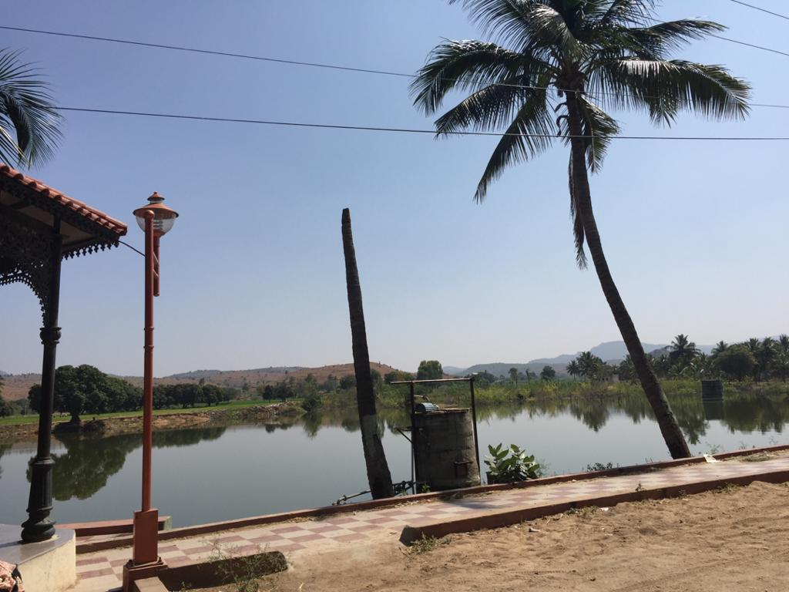
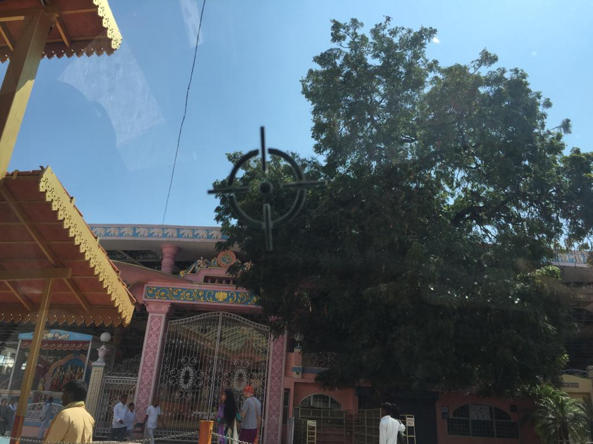
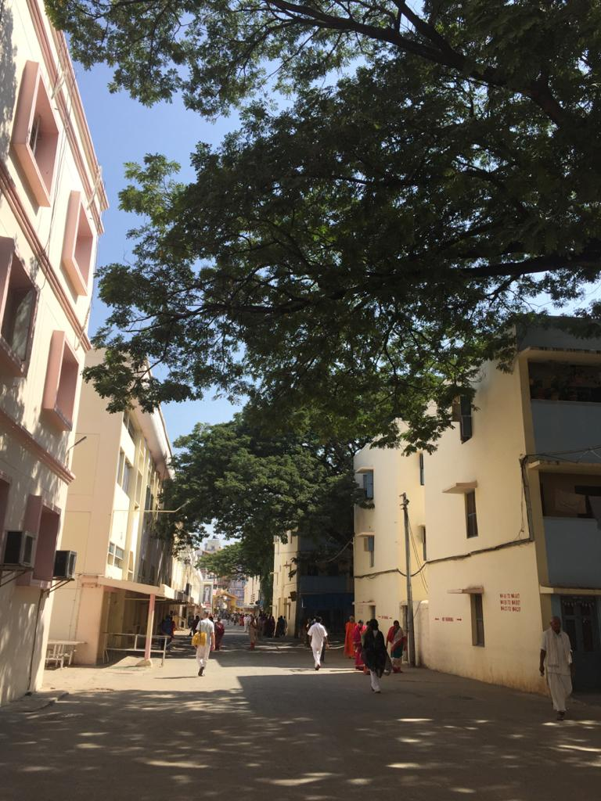
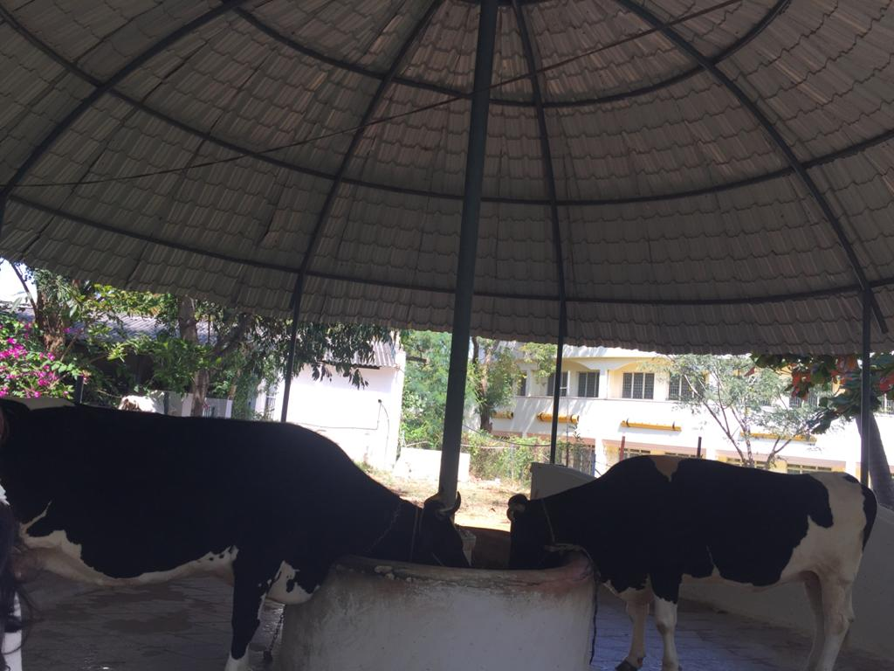

+++
author = "Jegatheswary T.Subramaniam"
title = "My Parthi Experience"
date = "2020-11-23"
description = "The moments which I cherish the most in Parthi."
slug = "my-parthi-experience"
image = "img_jegatheswary_subramaniam_1.jpeg"
comments = false
# draft = true
tags = [
    "Spiritual",
]
+++

---

My journey with Swami started when I was 7 years old. My neighbour who was also my tuition teacher at that time had  introduced Swami to me. At that time, I was too young to realise His guidance and was just fascinated hearing a lot of stories about Puttaparthi.

How it will be?

After over 40 years, finally the day came on 24th Jan 2020, Friday, when I attended my first evening Bhajan in Prasanthi Nilayam, Puttaparthi. I was mesmerised. 

To this day, the experience is unexplainable.

Sai Kulwant Hall was unforgettable, the taste of the coffee made from Gokulam milk is still lingering in my mouth, early morning 4am Suprabhatam, 5am Nagarasangkeerthanam was a bliss, Gayathri Amman temple was so inviting and the list goes on.

Experience in Sai Kulwant Hall was totally divine, tears rolled down my eyes just by listening to the bhajans. The vibes cannot be described, only felt. You have to be there to feel "Swami". I was there during Chinese New Year celebration. There were many  Chinese devotees and the Covid pandemic had started in Wuhan but I did not feel any fear. Why fear when I am Here, I felt as though Swami was whispering to me.

Every little thing there is very much cherished in my journey knowing Swami.

My humble pranams to dear Swami.

---

## Gallery

    

---